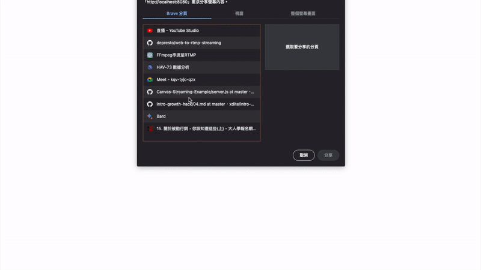

## 視窗串流小幫手 Chrome 2 RTMP Streaming



視窗串流小幫手可以幫您將網頁分頁、電腦螢幕一次串流至多個直播來源，透過視窗串流小幫手，您可以一次將會議畫面同步直播到 Youtube, Facebook 等多個串流。

這份程式碼是一個基於 Node.js 和 WebSocket 的串流伺服器，可以畫面透過 FFmpeg 輸出到多個 RTMP 伺服器。以下是使用說明和配置步驟：

### 1. 安裝 Node.js

首先，您需要安裝 Node.js，以便在本地環境中執行 JavaScript 程式。以下是在不同作業系統上安裝 Node.js 的步驟：

- **Windows**: 前往 Node.js 官方網站（https://nodejs.org），下載適用於 Windows 的安裝程式，然後執行安裝程式並按照提示進行安裝。

- **macOS**: 使用 Homebrew（https://brew.sh）在終端機中執行以下命令安裝 Node.js：

  ```
  brew install node
  ```

- **Linux**: 在終端機中執行適用於您的 Linux 發行版的套件管理器命令安裝 Node.js。例如，在 Ubuntu 上，您可以使用以下命令：

  ```
  sudo apt-get install nodejs
  ```

安裝完成後，您可以在終端機中執行 `node -v` 命令來確認 Node.js 是否已成功安裝。

### 2. 安裝 FFmpeg

為了使用 FFmpeg 的功能，您需要安裝並配置 FFmpeg 工具。以下是在不同作業系統上安裝 FFmpeg 的步驟：

- **Windows**: 前往 FFmpeg 官方網站（https://ffmpeg.org），在下載頁面中選擇適用於 Windows 的版本，下載壓縮檔案並解壓縮到您想要安裝的目錄中。然後，將 FFmpeg 的執行檔所在目錄新增到系統的 PATH 環境變數中。

- **macOS**: 使用 Homebrew 在終端機中執行以下命令安裝 FFmpeg：

  ```
  brew install ffmpeg
  ```

- **Linux**: 在終端機中執行適用於您的 Linux 發行版的套件管理器命令安裝 FFmpeg。例如，在 Ubuntu 上，您可以使用以下命令：

  ```
  sudo apt-get install ffmpeg
  ```

安裝完成後，您可以在終端機中執行 `ffmpeg -version` 命令來確認 FFmpeg 是否已成功安裝。

### 3. 安裝相依套件

確保您已經在您的專案資料夾中初始化了 Node.js 專案，並在終端機中執行以下命令以安裝所需的相依套件：

```


npm install
```

### 4. 配置 RTMP 伺服器

在專案資料夾中建立一個 `config.txt` 檔案，並在每一行中輸入一個 RTMP 伺服器的 URL。例如：

```
rtmp://your-rtmp-server-url1
rtmp://your-rtmp-server-url2
```

將每個 RTMP 伺服器的 URL 換成您自己的 RTMP 伺服器 URL。

### 5. 執行程式

在終端機中執行以下命令以啟動伺服器：

```
npm start
```

您應該會在終端機中看到 `Listening on {port}` 的訊息，表示伺服器已經成功啟動。

### 6. 連接到串流伺服器

在瀏覽器中打開一個網頁，輸入以下網址，網頁會跳出選取視窗，即可開始您的串流：

```
localhost:8080
```

### 7. 結束程式

當您要停止伺服器時，可以在終端機中按下 `Ctrl + C` 組合鍵以停止程式的執行。

請注意，這份程式碼是基於 FFmpeg 的 `ffmpeg` 命令行工具，因此請確保已經安裝並配置了 FFmpeg。同時，請確保您的 RTMP 伺服器是正確配置的並可供存取。

這是一個基本的使用說明，您可以根據您的需求進一步擴展和調整程式碼。請參考 Node.js、WebSocket 和 FFmpeg 的相關文件以獲取更多資訊和進一步的開發指引。
